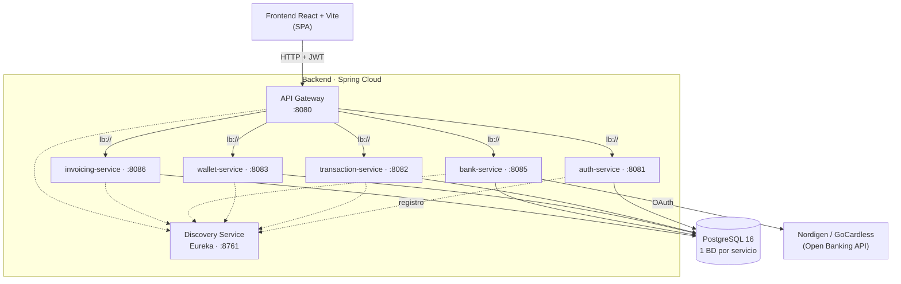

<div align="center">

# PayFlow

**Plataforma de finanzas personales y pagos basada en una arquitectura de microservicios.**

Gestiona tu dinero, monedero, transacciones, conexión bancaria (Open Banking) y facturación para autónomos desde una única aplicación.


</div>

---

## Tabla de contenidos

- [Descripción](#descripción)
- [Arquitectura](#arquitectura)
- [Stack tecnológico](#stack-tecnológico)
- [Estructura del proyecto](#estructura-del-proyecto)
- [Requisitos previos](#requisitos-previos)
- [Puesta en marcha](#puesta-en-marcha)
- [Servicios y puertos](#servicios-y-puertos)
- [Documentación de la API (Swagger)](#documentación-de-la-api-swagger)
- [Endpoints principales](#endpoints-principales)
- [Variables de entorno](#variables-de-entorno)
- [Tests](#tests)
- [Autor](#autor)

---

## Descripción

**PayFlow** es una aplicación de finanzas personales construida como **Trabajo de Fin de Grado**. El backend sigue una arquitectura de **microservicios** con Spring Boot y Spring Cloud, mientras que el frontend es una **SPA** desarrollada con React y Vite.

Cada microservicio es independiente, tiene su propia base de datos y se registra en un servidor de descubrimiento (Eureka). Todo el tráfico del cliente entra por un **API Gateway** único, que centraliza el enrutado, la validación de tokens **JWT** y el control de acceso por roles.

### Funcionalidades principales

- **Autenticación y usuarios** — registro, login con JWT, gestión de perfil y panel de administración de usuarios/roles.
- **Monedero (Wallet)** — saldo, envío de dinero entre usuarios y libro mayor (ledger) de movimientos.
- **Transacciones** — registro de ingresos/gastos, resúmenes y generación de informes en PDF.
- **Banca (Open Banking)** — conexión con cuentas bancarias reales mediante la API de Nordigen/GoCardless e importación de movimientos.
- **Facturación** — emisión de facturas y registro de gastos para autónomos, con resumen trimestral y exportación a PDF.

---

## Arquitectura



- **API Gateway** — punto de entrada único (Spring Cloud Gateway). Valida el JWT, aplica filtros de rol (`JwtAuthFilter`, `AdminRoleFilter`) y gestiona CORS.
- **Discovery Service** — registro de servicios con Netflix Eureka; el gateway resuelve los servicios por nombre (`lb://`).
- **Microservicios de negocio** — cada uno expone su API REST, persiste en su propia base de datos PostgreSQL y documenta sus endpoints con Swagger/OpenAPI.

---

## Stack tecnológico

### Backend
| Categoría | Tecnología |
|---|---|
| Lenguaje | Java 21 |
| Framework | Spring Boot 3.3.0 |
| Microservicios | Spring Cloud 2023.0.1 (Gateway, Eureka) |
| Seguridad | Spring Security + JWT (jjwt 0.12.5) |
| Persistencia | Spring Data JPA + Hibernate |
| Base de datos | PostgreSQL 16 |
| Documentación | springdoc-openapi (Swagger UI) |
| Build | Maven |

### Frontend
| Categoría | Tecnología |
|---|---|
| Librería | React 19 |
| Bundler | Vite 7 |
| Enrutado | React Router 7 |
| UI | Material UI 7, Bootstrap 5, Tailwind 4 |
| Gráficas | Recharts |
| Panel admin | React Admin 5 |
| Estilos | CSS Modules |

### Infraestructura
Docker · Docker Compose · PostgreSQL

---

## Estructura del proyecto

```
TFG/
├── backend/
│   ├── api-gateway/          # Spring Cloud Gateway (entrada única)
│   ├── discovery-service/    # Eureka (registro de servicios)
│   ├── auth-service/         # Autenticación, usuarios y roles
│   ├── transaction-service/  # Transacciones e informes
│   ├── wallet-service/       # Monedero y movimientos
│   ├── bank-service/         # Open Banking (Nordigen)
│   ├── invoicing-service/    # Facturas y gastos
│   ├── docker-compose.yml    # Orquestación completa
│   └── init.sql              # Creación de las bases de datos
│
└── frontend/                 # SPA React + Vite
    ├── src/
    │   ├── pages/             # Vistas (Home, Wallet, Banca, etc.)
    │   ├── components/        # Componentes reutilizables
    │   ├── context/           # Auth y tema (Context API)
    │   ├── admin/             # Panel de administración
    │   └── config/            # Cliente HTTP y servicios
    └── package.json
```

---

## Requisitos previos

- **Java 21** (JDK)
- **Maven 3.9+**
- **Node.js 18+** y npm
- **PostgreSQL 16** (o Docker para levantarlo)
- **Docker** y **Docker Compose** *(opcional, recomendado)*

---

## Puesta en marcha

### Opción A — Docker Compose (recomendado)

Levanta toda la plataforma (PostgreSQL + Eureka + gateway + microservicios) con un solo comando:

```bash
cd backend
docker compose up --build
```

### Opción B — Ejecución manual

1. **Base de datos** — arranca PostgreSQL y crea las bases de datos (ver [`init.sql`](backend/init.sql)).

2. **Discovery Service** (debe ir primero):
   ```bash
   cd backend/discovery-service
   mvn spring-boot:run
   ```

3. **API Gateway** y **microservicios** (cada uno en su terminal):
   ```bash
   cd backend/auth-service
   mvn spring-boot:run
   ```
   Repite para `transaction-service`, `wallet-service`, `bank-service`, `invoicing-service` y `api-gateway`.

4. **Frontend**:
   ```bash
   cd frontend
   npm install
   npm run dev
   ```
   La aplicación queda disponible en `http://localhost:5173`.

> **Nota:** para probar un microservicio de forma aislada (sin Eureka), arráncalo con la variable `EUREKA_ENABLED=false`.

---

## Servicios y puertos

| Servicio | Puerto | Base de datos | Descripción |
|---|---|---|---|
| `discovery-service` | `8761` | — | Registro de servicios (Eureka) |
| `api-gateway` | `8080` | — | Entrada única, JWT y enrutado |
| `auth-service` | `8081` | `auth_db` | Autenticación, usuarios y roles |
| `transaction-service` | `8082` | `transactions_db` | Transacciones e informes |
| `wallet-service` | `8083` | `wallet_db` | Monedero y movimientos |
| `bank-service` | `8085` | `bank_db` | Open Banking (Nordigen) |
| `invoicing-service` | `8086` | `invoicing_db` | Facturas y gastos |

---

## Documentación de la API (Swagger)

Cada microservicio publica su propia documentación interactiva con **Swagger UI**. Con el servicio en marcha, accede a:

```
http://localhost:<puerto>/swagger-ui/index.html
```

| Servicio | URL Swagger |
|---|---|
| auth-service | http://localhost:8081/swagger-ui/index.html |
| transaction-service | http://localhost:8082/swagger-ui/index.html |
| wallet-service | http://localhost:8083/swagger-ui/index.html |
| bank-service | http://localhost:8085/swagger-ui/index.html |
| invoicing-service | http://localhost:8086/swagger-ui/index.html |

La especificación OpenAPI en JSON está disponible en `http://localhost:<puerto>/v3/api-docs`.

---

## Endpoints principales

Todas las rutas se consumen a través del API Gateway (`http://localhost:8080`).

| Método | Ruta | Auth | Descripción |
|---|---|:---:|---|
| `POST` | `/auth/register` | — | Registrar usuario |
| `POST` | `/auth/login` | — | Iniciar sesión (devuelve JWT) |
| `POST` | `/auth/reset-password` | — | Restablecer contraseña |
| `GET` | `/auth/me` | JWT | Obtener perfil |
| `GET` | `/admin/users` | ADMIN | Listar usuarios |
| `PUT` | `/admin/users/{id}/rol` | ADMIN | Cambiar rol |
| `DELETE` | `/admin/users/{id}` | ADMIN | Eliminar usuario |
| `GET/POST` | `/transactions/**` | JWT | Gestión de transacciones |
| `GET/POST` | `/wallet/**` | JWT | Operaciones del monedero |
| `GET` | `/bank/institutions` | — | Listar bancos disponibles |
| `*` | `/bank/**` | JWT | Conexión y movimientos bancarios |
| `*` | `/invoices/**` | JWT | Facturas |
| `*` | `/expenses/**` | JWT | Gastos |

> Los endpoints protegidos requieren la cabecera `Authorization: Bearer <token>`.

---

## Variables de entorno

| Variable | Por defecto | Descripción |
|---|---|---|
| `DB_URL` | `jdbc:postgresql://localhost:5432/<db>` | URL de la base de datos |
| `DB_USER` | `postgres` | Usuario de la base de datos |
| `DB_PASS` | `payflow123` | Contraseña de la base de datos |
| `EUREKA_URI` | `http://localhost:8761/eureka` | URL del servidor Eureka |
| `EUREKA_ENABLED` | `false` | Activa/desactiva el registro en Eureka |
| `JWT_SECRET` | `payflow-super-secret-key-2024-tfg` | Clave de firma de los JWT |
| `MAIL_USER` / `MAIL_PASS` | — | Credenciales SMTP (recuperación de contraseña) |

---
/
## Tests

Tests unitarios de la capa de servicio con JUnit 5 y Mockito:

```bash
cd backend/auth-service   # o transaction-service / wallet-service
mvn test
```

---

## Autor

**Iker Martínez Velasco** — Trabajo de Fin de Grado (DAW).
